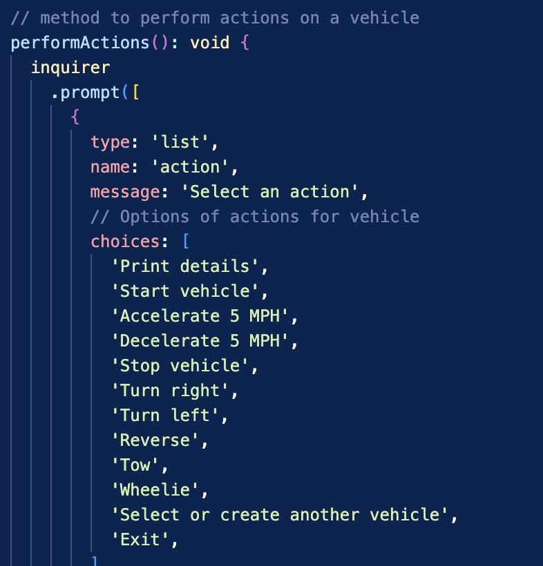
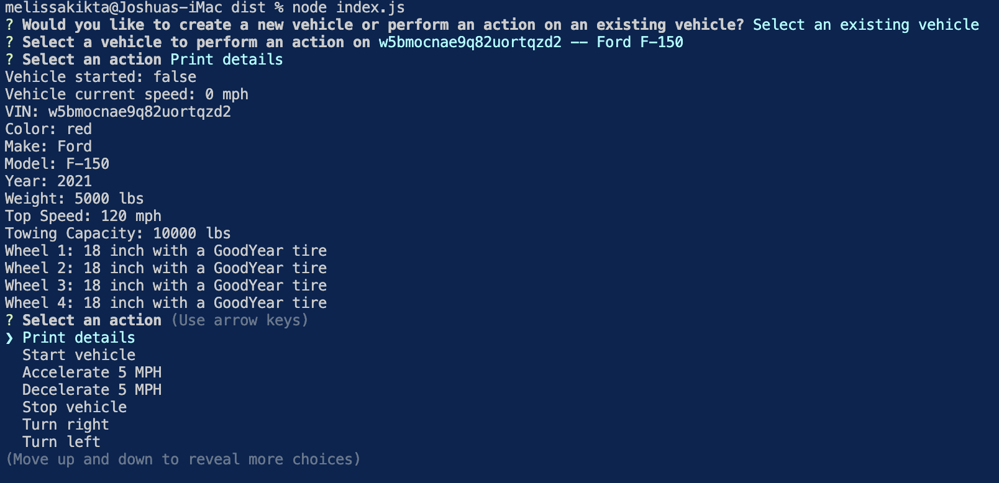
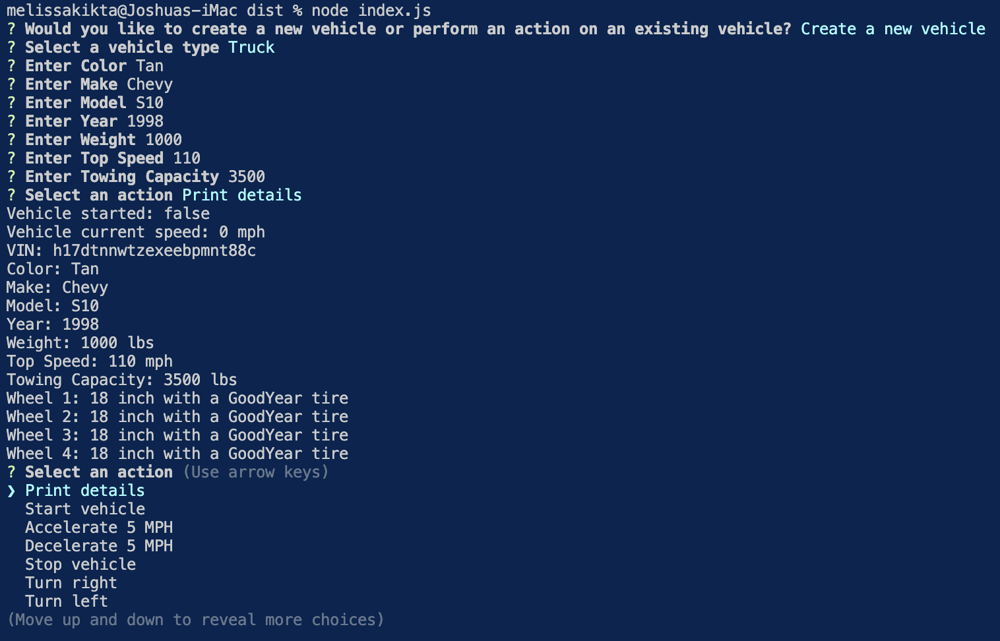
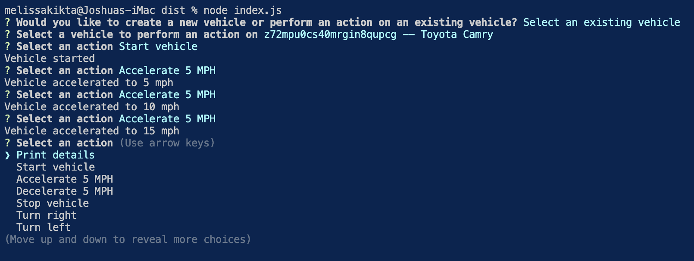

# Kikta_Vehicle_Builder
TypeScript command-line application that prompts for information on user options for cars, motorbikes, and trucks.

## 📚 Description
This application is designed to allow the user to access information about cars and add options for truck and motorbikes. Through a series of prompts the user can create new vehicles or select existing vehicles. Based on the selection of of new or exsisting cars, the user can perform additional actions with the vehicle. 

A video tutorial can be found [here](https://drive.google.com/file/d/1RD-HuWyUbWBZ7rc2hKB-S1zRYbrDF4GG/view?usp=sharing)

## 🚀 Table of Contents
  * [Usage](#📝-Usage)
  * [Installations](#🛠-installation)
  * [Features](#⭐-features)
  * [Credits](#🫱🏽‍🫲🏾-credits)
  * [License](#📃-license)
  * [Contact](#🗨️-contact)

## 📝 Usage - Fix Pictures
<strong>Using Vehicles and Creating New Vehicles</strong>

This program is designed to be used as a command-line application to expand a current car application to include selections for trucks and motorbikes. It will then prompt the user for action prompts based on the selection of new or existing vehicles. 

<u><strong>Initial Code Prompt:</strong></u>

<u><strong>Prompt of Existing Vehicle</strong></u>

<u><strong>Prompt of New Vehicle</strong></u>

<u><strong>Prompt for Additional Actions</strong></u>

Back to [Table-of-Contents](#🚀-table-of-contents)

## 🛠 Installation
<strong>1. Clone the Repository to your machine.</strong>
You need gto copy the repository to your local machine.

    git clone https://github.com/melissakikta/Kikta_Vehicle_Builder 

<strong>2. Navigate to the Project Directory</strong>

    cd Kikta_Vehicle_Builder 
    

<strong>3. Install Dependencies</strong>

This application requires the dependency: inquirer. This must be installed before the appication will perform. 

    npm install

<strong>4. Start the program </strong>

This application requires to dependencies: fs and inquirer. These must be installed before the appication will perform. 

    npm start

Back to [Table-of-Contents](#🚀-table-of-contents)

## ⭐ Features
  * Uses the initial car application to perform actions with existing vehicles.
  * Creates new vehicles with a Truck or Motorbike classification.
  * Actions continue until exited by the user. 

Back to [Table-of-Contents](#🚀-table-of-contents)

## 🫱🏽‍🫲🏾 Credits
This applications requires the use of the npm package <strong>inquirer</strong>. Please find information regarding its creditials below:

GitHub Repository: [GitHub.com/SBoudrias/Inquirer.js](https://github.com/SBoudrias/Inquirer.js)

Back to [Table-of-Contents](#🚀-table-of-contents)

## 📃 License
This application is unlicensed. 

Back to [Table-of-Contents](#🚀-table-of-contents)

## 🗨️ Contact

  <strong>Email:</strong> [MelissaKikta2025@u.northwestern.edu](mailto:MelissaKikta@u.northwestern.edu)
  
  <strong>GitHub:</strong> [GitHub.com/MelissaKikta](https://github.com/melissakikta)

Back to [Table-of-Contents](#🚀-table-of-contents)

